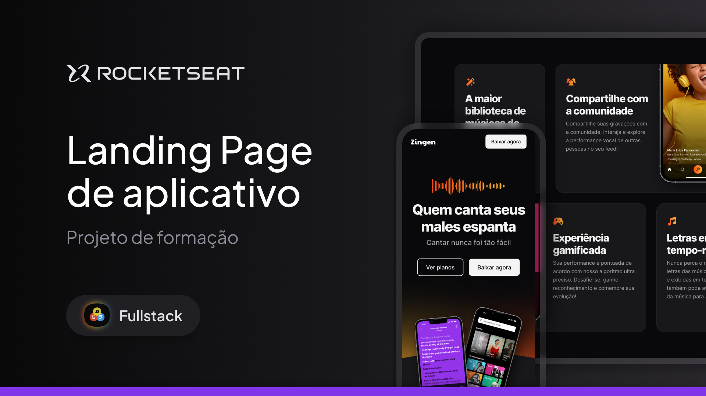

## Zingen

  

## 🖥️ Sobre o Projeto

Neste repositório está hospedado uma landing page responsiva e super criativa com informe de promover um aplicativo de karapkê. Este projeto foi desenvolvido sob acompanhamento do curso da Rocketseat para consolidar os fundamentos da responsividade com css.

## 🚧 Status

O projeto encontra-se 100% finalizado.

## 🍪 Acesso ao Projeto

Este projeto pode ser visualizado através deste [link](https://ppedrolucas.github.io/Zingen/).

## 🚀 Tecnologias

As seguintes ferramentas foram usadas para o desenvolvimento do projeto:

  

Feito com ❤️ por Pedro Lucas 👋🏽
